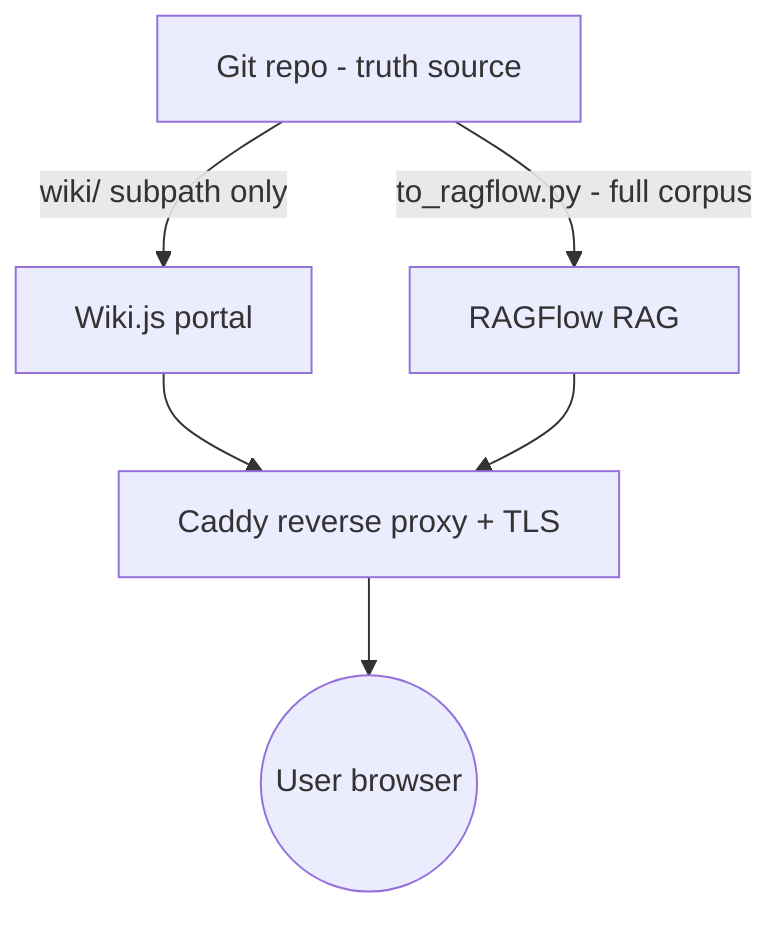

<objective>
Ship the v1 deployment topology as a **DRAFT only** — no services run, nothing executed. Cover DEP-01 (compose draft) + DEP-02 (.env.example) + DEP-03 (topology diagram) + DEP-04 (Wiki.js Git scope = `wiki/` only) + DEP-05 (Authentik deferred, RAGFlow OIDC bug) + DEP-06 (backup/restore note).

Purpose: Phase 6 deliverable that lets a future deployment phase pick up a runnable starting point without re-deciding stack, ports, volumes, or auth posture.

Output: Six files under `deploy/` that together specify the v1 single-host topology.
</objective>

<execution_context>
@$HOME/.claude/get-shit-done/workflows/execute-plan.md
@$HOME/.claude/get-shit-done/templates/summary.md
</execution_context>

<context>
@.planning/PROJECT.md
@.planning/ROADMAP.md
@.planning/research/STACK.md
@.planning/research/ARCHITECTURE.md
@.planning/research/PITFALLS.md
@.planning/REQUIREMENTS.md
@CLAUDE.md

<interfaces>
<!-- Locked stack (from STACK.md, frozen since Phase 1) -->
- Wiki.js: image `requarks/wiki:2.5.314` (DO NOT use `:latest` or `:2`)
- PostgreSQL: image `postgres:16` (Wiki.js DB; pg_trgm extension required for FTS)
- RAGFlow: image `infiniflow/ragflow:v0.25.1` (DO NOT use `:nightly` or `:latest`)
- Caddy: image `caddy:2` (reverse proxy)
- Redis: image `redis:7` (Wiki.js cache + RAGFlow task queue, single shared instance OK for v1)
- Elasticsearch: image `docker.elastic.co/elasticsearch/elasticsearch:8.13.0` (RAGFlow's vector + sparse backend)
- MinIO: image `minio/minio:latest` (RAGFlow document originals; bundled with RAGFlow's compose)

<!-- Hard rules from PITFALLS / REQUIREMENTS / CLAUDE.md -->
- DEP-04: Wiki.js Git storage scope = `wiki/` subdirectory ONLY. NEVER the full repo (would let editors corrupt `ontology/`, `instances/`, `scripts/`).
- DEP-05: Authentik is DEFERRED — RAGFlow OIDC has open bug #12568 (Keycloak redirect loop since Quart migration) and FR #3495. Authentik service block in compose MUST be commented out, with a header comment block citing both issue numbers.
- DEP-06: RAGFlow vector store + Elasticsearch indexes are REBUILDABLE derivatives — they are NOT backed up; document re-ingestion runbook instead. Truth backup = Postgres dump + Git push.
- No hardcoded secrets. Every secret-shaped env var (POSTGRES_PASSWORD, WIKI_JS_DB_PASS, RAGFLOW_SECRET_KEY, etc.) is a placeholder like `<CHANGE_ME>` in `.env.example`.

<!-- Existing scaffolds -->
- `deploy/wiki-js/.gitkeep`, `deploy/ragflow/.gitkeep`, `deploy/caddy/.gitkeep`, `deploy/authentik/.gitkeep`, `deploy/docker-compose/.gitkeep` already exist (Phase 1 scaffolding). Plans here ADD files to `deploy/` root (not under subdirs).
</interfaces>
</context>

<tasks>

<task type="auto">
  <name>Task 1: docker-compose.yml.draft + .env.example + topology.md (DEP-01, DEP-02, DEP-03)</name>
  <files>deploy/docker-compose.yml.draft, deploy/.env.example, deploy/topology.md</files>

  <read_first>
    - `.planning/research/STACK.md` §"Core Technologies" (image versions, hardware sizing) — AUTHORITY for image tags
    - `.planning/research/ARCHITECTURE.md` §"System Overview" (the layered diagram to mirror in topology.md)
    - `.planning/research/PITFALLS.md` Pitfalls 1-12 (anything compose-shaped that violates a pitfall must be ruled out by a comment in the YAML)
    - `CLAUDE.md` Constraints section (Wiki.js + RAGFlow stack frozen; v1 single-host)
  </read_first>

  <action>
Create `deploy/docker-compose.yml.draft` with the following structure. Every line begins with the DRAFT sentinel header. Inline content shown below — the executor must use this verbatim, expanding only volume paths and adding sensible health-check + restart policies.

```yaml
# ============================================================================
# DRAFT — NOT FOR PRODUCTION
# ============================================================================
# Aviation Knowledge Base v1 deployment topology — DESIGN DRAFT ONLY.
# This file is NOT runnable as-is. It is a Phase 6 deliverable that locks the
# stack, image versions, env vars, port layout, and volume topology so a
# future deployment phase can promote it to a real compose file.
#
# Source of truth: .planning/research/STACK.md (image versions),
# .planning/research/ARCHITECTURE.md (data flow), CLAUDE.md (constraints).
#
# To promote this file to production:
#   1. Copy to deploy/docker-compose.yml (drop the .draft suffix)
#   2. Replace every <CHANGE_ME> placeholder in deploy/.env.example
#   3. Wire deploy/caddy/Caddyfile (TLS + path routing) — currently a stub
#   4. Validate Wiki.js Git scope is wiki/ ONLY (see deploy/wiki-git-storage.md)
#   5. Decide on SSO posture (see deploy/authentik-phase2.md — currently DEFERRED)
#   6. Run `docker compose config` to verify; only then `up -d`
# ============================================================================

version: "3.8"

x-shared-network: &shared-network
  networks:
    - akb-net

services:

  # --------------------------------------------------------------------------
  # Wiki.js — knowledge portal (human-authored Markdown pages)
  # Postgres-backed; Git-sync module pushes pages to wiki/ ONLY (DEP-04).
  # See deploy/wiki-git-storage.md for the Git scope rule.
  # --------------------------------------------------------------------------
  wiki:
    image: requarks/wiki:2.5.314
    restart: unless-stopped
    depends_on:
      postgres:
        condition: service_healthy
    environment:
      DB_TYPE: postgres
      DB_HOST: postgres
      DB_PORT: 5432
      DB_USER: ${WIKI_DB_USER}
      DB_PASS: ${WIKI_DB_PASS}
      DB_NAME: ${WIKI_DB_NAME}
      # Git storage module — scope MUST be wiki/ subdirectory only (DEP-04)
      WIKI_GIT_REMOTE_URL: ${WIKI_GIT_REMOTE_URL}
      WIKI_GIT_BRANCH: ${WIKI_GIT_BRANCH}
      WIKI_GIT_SUBPATH: wiki    # hard-coded — see deploy/wiki-git-storage.md
    ports:
      - "${WIKI_HOST_PORT}:3000"
    <<: *shared-network

  postgres:
    image: postgres:16
    restart: unless-stopped
    environment:
      POSTGRES_USER: ${WIKI_DB_USER}
      POSTGRES_PASSWORD: ${WIKI_DB_PASS}
      POSTGRES_DB: ${WIKI_DB_NAME}
    volumes:
      - postgres_data:/var/lib/postgresql/data
    healthcheck:
      test: ["CMD-SHELL", "pg_isready -U ${WIKI_DB_USER}"]
      interval: 10s
      timeout: 5s
      retries: 5
    <<: *shared-network

  # --------------------------------------------------------------------------
  # RAGFlow — RAG ingestion + retrieval + citation pipeline.
  # OpenDataLoader-PDF backend (v0.25 default).
  # See .planning/design/RAG_PIPELINE.md for the design contract.
  # --------------------------------------------------------------------------
  ragflow:
    image: infiniflow/ragflow:v0.25.1
    restart: unless-stopped
    depends_on:
      - elasticsearch
      - minio
      - redis
    environment:
      RAGFLOW_DB_TYPE: ${RAGFLOW_DB_TYPE}
      RAGFLOW_SECRET_KEY: ${RAGFLOW_SECRET_KEY}
      RAGFLOW_ES_HOST: elasticsearch
      RAGFLOW_MINIO_HOST: minio
      RAGFLOW_REDIS_HOST: redis
      DEVICE: ${RAGFLOW_DEVICE}    # cpu | gpu (per STACK.md hardware sizing)
    ports:
      - "${RAGFLOW_HOST_PORT}:9380"
    <<: *shared-network

  elasticsearch:
    image: docker.elastic.co/elasticsearch/elasticsearch:8.13.0
    restart: unless-stopped
    environment:
      discovery.type: single-node
      xpack.security.enabled: "false"
      ES_JAVA_OPTS: "-Xms2g -Xmx2g"
    volumes:
      - es_data:/usr/share/elasticsearch/data
    <<: *shared-network

  minio:
    image: minio/minio:latest
    restart: unless-stopped
    command: server /data --console-address ":9001"
    environment:
      MINIO_ROOT_USER: ${MINIO_ROOT_USER}
      MINIO_ROOT_PASSWORD: ${MINIO_ROOT_PASSWORD}
    volumes:
      - minio_data:/data
    <<: *shared-network

  redis:
    image: redis:7
    restart: unless-stopped
    volumes:
      - redis_data:/data
    <<: *shared-network

  # --------------------------------------------------------------------------
  # Caddy — reverse proxy + TLS termination.
  # Caddyfile is a STUB in deploy/caddy/Caddyfile (Phase 6 leaves it empty;
  # promotion phase fills in path routing for / -> wiki, /rag -> ragflow).
  # --------------------------------------------------------------------------
  caddy:
    image: caddy:2
    restart: unless-stopped
    depends_on:
      - wiki
      - ragflow
    ports:
      - "80:80"
      - "443:443"
    volumes:
      - ./caddy/Caddyfile:/etc/caddy/Caddyfile:ro
      - caddy_data:/data
      - caddy_config:/config
    <<: *shared-network

  # --------------------------------------------------------------------------
  # Authentik — SSO IdP (DEFERRED to a future phase).
  # See deploy/authentik-phase2.md for rationale.
  # ENTIRE BLOCK COMMENTED OUT until RAGFlow OIDC bug #12568 is resolved
  # upstream and FR #3495 is closed.
  # --------------------------------------------------------------------------
  # authentik:
  #   image: ghcr.io/goauthentik/server:2024.10
  #   restart: unless-stopped
  #   environment:
  #     AUTHENTIK_SECRET_KEY: ${AUTHENTIK_SECRET_KEY}
  #     AUTHENTIK_POSTGRESQL__HOST: postgres
  #     AUTHENTIK_POSTGRESQL__USER: ${AUTHENTIK_DB_USER}
  #     AUTHENTIK_POSTGRESQL__PASSWORD: ${AUTHENTIK_DB_PASS}
  #   ports:
  #     - "9000:9000"
  #   networks:
  #     - akb-net

networks:
  akb-net:
    driver: bridge

volumes:
  postgres_data:
  es_data:
  minio_data:
  redis_data:
  caddy_data:
  caddy_config:
```

Then create `deploy/.env.example` — every `${VAR}` in compose appears below as a row with a placeholder and a one-line comment. NO real secrets. Use this verbatim:

```bash
# ============================================================================
# DRAFT — NOT FOR PRODUCTION
# ============================================================================
# Aviation Knowledge Base v1 — environment variable template.
# Copy to .env (gitignored) and replace every <CHANGE_ME> before promoting
# docker-compose.yml.draft to docker-compose.yml.
#
# Topology summary (full diagram in deploy/topology.md):
#   Git ─┬─> Wiki.js (wiki/ scope only) ──┐
#        └─> RAGFlow (full corpus)        ├─> Caddy ──> User
#                                          │
#                       Postgres ──────────┘
# ============================================================================

# --- Wiki.js ----------------------------------------------------------------
WIKI_HOST_PORT=3000               # Host port mapped to Wiki.js container :3000
WIKI_DB_USER=wikijs               # Postgres user owning Wiki.js DB
WIKI_DB_PASS=<CHANGE_ME>          # Postgres password — generate via `openssl rand -hex 24`
WIKI_DB_NAME=wiki                 # Postgres database name

# Wiki.js Git Storage module — DEP-04 SCOPE RULE:
# WIKI_GIT_REMOTE_URL must point at the SAME repo as the canonical Git remote;
# WIKI_GIT_SUBPATH is HARD-CODED to "wiki" in compose (do NOT override).
# Wiki.js will read/write ONLY under wiki/ — never ontology/, instances/, scripts/, .planning/.
# See deploy/wiki-git-storage.md for the full rule and rationale.
WIKI_GIT_REMOTE_URL=<CHANGE_ME>   # e.g. git@github.com:org/aviation-knowledge-base.git
WIKI_GIT_BRANCH=main              # Git branch Wiki.js writes to

# --- RAGFlow ---------------------------------------------------------------
RAGFLOW_HOST_PORT=9380            # Host port mapped to RAGFlow container :9380
RAGFLOW_DB_TYPE=elasticsearch     # elasticsearch | infinity (v0.25 default ES)
RAGFLOW_SECRET_KEY=<CHANGE_ME>    # Generate via `openssl rand -hex 32`
RAGFLOW_DEVICE=cpu                # cpu | gpu — per STACK.md hardware sizing

# --- MinIO (RAGFlow object store) ------------------------------------------
MINIO_ROOT_USER=<CHANGE_ME>       # MinIO root user — DO NOT use "minioadmin"
MINIO_ROOT_PASSWORD=<CHANGE_ME>   # MinIO root password — `openssl rand -hex 24`

# --- Authentik (DEFERRED — see deploy/authentik-phase2.md) -----------------
# These vars are referenced ONLY by the commented-out authentik service block
# in docker-compose.yml.draft. Leave as <DEFERRED> until SSO is enabled.
AUTHENTIK_SECRET_KEY=<DEFERRED>
AUTHENTIK_DB_USER=<DEFERRED>
AUTHENTIK_DB_PASS=<DEFERRED>
```

Then create `deploy/topology.md` with the data-flow diagram, mirroring ARCHITECTURE.md System Overview. Include AI 接力 header. Use this exact ASCII diagram:

```
+-------------------------------------------------------------+
|                         Git (truth)                          |
|  ontology/  instances/  docs/  wiki/  .planning/  scripts/   |
+----------------+--------------------+-----------------------+
                 |                    |
                 |  (wiki/ only)      |  (full corpus,
                 |  via Wiki.js Git   |   read-only via
                 v  Storage module)   v   to_ragflow.py)
        +----------------+      +----------------+
        |   Wiki.js      |      |   RAGFlow      |
        |   (Postgres)   |      |   (ES + MinIO  |
        |                |      |    + Redis)    |
        +-------+--------+      +-------+--------+
                |                       |
                +-----------+-----------+
                            |
                            v
                     +-------------+
                     |    Caddy    |
                     | (TLS proxy) |
                     +------+------+
                            |
                            v
                       +---------+
                     User (browser)
                       +---------+
```

Plus a Mermaid alternative for renderers that prefer it:



Add a 1-paragraph narrative below the diagrams explaining: Git is the truth source; Wiki.js subscribes only to `wiki/` (DEP-04); RAGFlow indexes the full corpus via the `to_ragflow.py` exporter; Caddy fronts both with TLS; vector store is rebuildable from Git (DEP-06).

Include "AI 接力开发指南" header at the top stating: this doc is the single visual + textual contract for v1 topology; locked stack from STACK.md; cross-link to docker-compose.yml.draft, .env.example, wiki-git-storage.md, authentik-phase2.md, backup-restore.md.
  </action>

  <acceptance_criteria>
- `find deploy/docker-compose.yml.draft deploy/.env.example deploy/topology.md -type f` lists all three files
- `grep -q "DRAFT — NOT FOR PRODUCTION" deploy/docker-compose.yml.draft`
- `grep -q "DRAFT — NOT FOR PRODUCTION" deploy/.env.example`
- `python3 -c "import yaml; yaml.safe_load(open('deploy/docker-compose.yml.draft'))"` exits 0
- `grep -E "^\s+(wiki|postgres|ragflow|caddy|elasticsearch|minio|redis):" deploy/docker-compose.yml.draft` shows all 7 declared services
- `grep -E "^\s+# authentik:" deploy/docker-compose.yml.draft` shows authentik block commented out
- `grep -q "12568" deploy/docker-compose.yml.draft` (RAGFlow OIDC bug ref present in authentik comment)
- Every `${VAR}` from compose appears in `.env.example`: `for v in WIKI_HOST_PORT WIKI_DB_USER WIKI_DB_PASS WIKI_DB_NAME WIKI_GIT_REMOTE_URL WIKI_GIT_BRANCH RAGFLOW_HOST_PORT RAGFLOW_DB_TYPE RAGFLOW_SECRET_KEY RAGFLOW_DEVICE MINIO_ROOT_USER MINIO_ROOT_PASSWORD AUTHENTIK_SECRET_KEY AUTHENTIK_DB_USER AUTHENTIK_DB_PASS; do grep -q "^$v=" deploy/.env.example || echo "MISSING $v"; done` produces no MISSING output
- No hardcoded secrets: `grep -E "=(password|secret|admin123|minioadmin)$" deploy/.env.example` returns no matches; instead `grep -c "<CHANGE_ME>" deploy/.env.example` ≥ 5
- `grep -q "Git" deploy/topology.md && grep -q "Wiki.js" deploy/topology.md && grep -q "RAGFlow" deploy/topology.md && grep -q "Caddy" deploy/topology.md`
- `grep -q "AI 接力开发指南" deploy/topology.md`
  </acceptance_criteria>

  <verify>
    <automated>cd /Users/Zhuanz/aviation-knowledge-base &amp;&amp; test -f deploy/docker-compose.yml.draft &amp;&amp; test -f deploy/.env.example &amp;&amp; test -f deploy/topology.md &amp;&amp; grep -q "DRAFT — NOT FOR PRODUCTION" deploy/docker-compose.yml.draft &amp;&amp; grep -q "DRAFT — NOT FOR PRODUCTION" deploy/.env.example &amp;&amp; python3 -c "import yaml; yaml.safe_load(open('deploy/docker-compose.yml.draft'))" &amp;&amp; grep -qE "^\s+# authentik:" deploy/docker-compose.yml.draft &amp;&amp; grep -q "12568" deploy/docker-compose.yml.draft &amp;&amp; grep -q "AI 接力开发指南" deploy/topology.md</automated>
  </verify>

  <done>
Compose draft parses as valid YAML, has DRAFT header, declares wiki/postgres/ragflow/elasticsearch/minio/redis/caddy as services, has authentik commented out with the OIDC bug ref. .env.example covers every compose variable with placeholders. topology.md has ASCII + Mermaid diagrams plus narrative. No hardcoded secrets anywhere.
  </done>
</task>

<task type="auto">
  <name>Task 2: wiki-git-storage.md + authentik-phase2.md + backup-restore.md (DEP-04, DEP-05, DEP-06)</name>
  <files>deploy/wiki-git-storage.md, deploy/authentik-phase2.md, deploy/backup-restore.md</files>

  <read_first>
    - `.planning/research/PITFALLS.md` (Pitfall 4 — schema migration, Pitfall 11 — bidirectional Wiki.js Git sync risks)
    - `.planning/research/STACK.md` §"Auth / Reverse Proxy" (Authentik posture; OIDC bug references)
    - `.planning/research/ARCHITECTURE.md` §"Storage Layer" + §"Backup/Recovery"
    - `CLAUDE.md` Constraints (DEP-04 hard rule on Wiki.js Git scope)
    - `deploy/docker-compose.yml.draft` (just authored — these docs cross-link back)
  </read_first>

  <action>
Create `deploy/wiki-git-storage.md` covering DEP-04. Sections:

1. **AI 接力开发指南** (locked vs directional table; what this doc is/is not; 5-min stranger test checklist).
2. **The hard rule (TL;DR)**: Wiki.js Git Storage module scope = `wiki/` subdirectory ONLY. NEVER the full repo. Stated as a single sentence with bold and a horizontal rule above and below.
3. **Why this rule exists** (≥3 reasons):
   - Wiki.js editors are humans authoring Markdown; if they had write access to `ontology/`, `instances/`, or `scripts/`, a single fat-finger could corrupt schemas, validators, or canonical instance YAML — bypassing CI.
   - The validator pipeline (Phase 3) assumes `instances/` and `ontology/` are only modified via PR with green CI. Wiki.js Git push happens out-of-band (no PR, no CI). Mixing these violates the audit trail.
   - Phase 4's `_pending/` quarantine pattern (PROV-05) depends on canonical promotion happening only via reviewed PR. Wiki.js scope creep would let unreviewed content slip into canonical.
4. **How to enforce** — three layers:
   - Compose env: `WIKI_GIT_SUBPATH: wiki` is hard-coded in `docker-compose.yml.draft` (NOT in `.env.example`). Reviewers reject any PR that moves it to `.env.example` or removes it.
   - CI guard (future phase): a CI job MAY add `git log --since=1d --name-only -- 'ontology/*' 'instances/*' 'scripts/*' | grep wiki-js-bot` to detect Wiki.js bot commits outside `wiki/`. Document the script idea but do not implement in Phase 6.
   - Wiki.js admin UI: Git Storage module config in Wiki.js admin panel must show "Local repo path: /repo/wiki" — there is no UI override; the env var is binding.
5. **What lives in `wiki/`**: human-authored narrative pages summarizing entities, indexed lookups, ATA chapter overviews, project notes, glossary mirrors. NOT: source PDFs, YAML instances, schemas, validators, design docs.
6. **Cross-references**: link to `docker-compose.yml.draft` (line where `WIKI_GIT_SUBPATH` is set), `.env.example` (where `WIKI_GIT_REMOTE_URL` is configured), `topology.md` (data flow), `.planning/research/ARCHITECTURE.md` §"Knowledge Layer".

Then create `deploy/authentik-phase2.md` covering DEP-05. Sections:

1. **AI 接力开发指南** (this is a deferred-feature spec, not a deployment doc).
2. **Status: DEFERRED** — banner at top.
3. **Why deferred (the bug stack)**:
   - RAGFlow OIDC FR #3495 — feature still pending upstream as of 2026-05.
   - RAGFlow OIDC bug #12568 — Keycloak redirect-loop since RAGFlow's Quart migration. Symptom: login flow loops between RAGFlow and IdP without ever issuing the session cookie.
   - Authentik's Wiki.js OIDC integration is documented and works (StackOverflow + Authentik docs), so Wiki.js side is ready. RAGFlow side blocks unification.
4. **What's already in compose**: the `authentik:` service block is present but ENTIRELY commented out. The env vars (`AUTHENTIK_SECRET_KEY`, `AUTHENTIK_DB_USER`, `AUTHENTIK_DB_PASS`) are declared in `.env.example` with `<DEFERRED>` placeholders. To activate: uncomment the block, set env vars, add Caddy routing, configure Wiki.js OIDC — but NOT RAGFlow until upstream resolves.
5. **Promote when X (the trigger condition)** — this is the bridge to ROADMAP_FUTURE.md: "Promote when (a) RAGFlow issue #12568 is closed AND (b) RAGFlow FR #3495 is merged AND (c) we have ≥2 confirmed user accounts that need cross-service navigation." Include a checklist.
6. **Workaround pattern (if SSO is needed before RAGFlow OIDC ships)**: put RAGFlow behind Caddy `forward_auth` to Authentik — Caddy authenticates, then proxies to RAGFlow's local-account login. Document this as an option but flag it as a workaround, not a permanent design.
7. **Cross-references**: `docker-compose.yml.draft` (commented authentik block), `.env.example` (DEFERRED vars), `.planning/ROADMAP_FUTURE.md` (06-03 promote-when rule), `.planning/research/STACK.md` §"Auth / Reverse Proxy".

Then create `deploy/backup-restore.md` covering DEP-06. Sections:

1. **AI 接力开发指南**.
2. **Backup matrix** (table):

   | Asset | Where it lives | Backup method | Restore-from-zero method | Frequency |
   |-------|----------------|---------------|--------------------------|-----------|
   | Ontology + instances + docs metadata + design docs | Git (truth) | `git push` to remote | `git clone` | Per commit |
   | Wiki.js page content | Postgres (cache) AND Git (`wiki/` via Wiki.js Git Storage module) | `pg_dump` + Wiki.js Git push | Restore Postgres dump OR re-pull from Git via Wiki.js Git Storage | Nightly pg_dump; per-edit Git push |
   | Wiki.js users / config | Postgres only | `pg_dump` | Restore from dump | Nightly |
   | Source documents (PDFs, DOCX) | Git LFS (`docs/`) AND MinIO (RAGFlow originals) | `git push` (LFS) — MinIO is derivative | `git lfs pull` repopulates `docs/`; MinIO repopulates from `to_ragflow.py --rebuild` | Per commit |
   | RAGFlow vector store (Elasticsearch indexes) | Elasticsearch volume | **NOT backed up** — REBUILDABLE from Git via `to_ragflow.py --rebuild` | Re-run ingestion | N/A |
   | RAGFlow MinIO blobs (parsed chunks) | MinIO volume | **NOT backed up** — REBUILDABLE | Re-run ingestion | N/A |
   | RAGFlow Postgres (citation metadata) | Postgres (separate DB or schema) | Optional `pg_dump` | Restore OR rebuild from Git | Optional nightly |

3. **Truth backup runbook** (the only thing that MUST be backed up):
   - Daily: `pg_dump -h localhost -U wikijs wiki > backups/wiki_$(date +%F).sql`
   - Daily (or per-PR via CI): `git push origin main`
   - Weekly: rsync `backups/` directory to off-host storage
4. **Derivative rebuild runbook** (after a worst-case rebuild):
   - Step 1: `git clone` the canonical repo
   - Step 2: bring up Postgres + Wiki.js, `psql < wiki_<date>.sql` (restore page DB)
   - Step 3: bring up RAGFlow + Elasticsearch + MinIO with empty volumes
   - Step 4: run `python scripts/exporters/to_ragflow.py --rebuild` to repopulate vector store from Git
   - Step 5: smoke test — query a known fixture, verify citation resolves
5. **Why vector store is rebuildable, not backup-worthy**: rationale paragraph citing PITFALLS Pitfall 11 (truth + cache discipline) and ARCHITECTURE.md §"Storage Layer" key boundary principle "Git holds the truth."
6. **Cross-references**: `topology.md`, `.planning/research/ARCHITECTURE.md` §"Storage Layer", `scripts/exporters/to_ragflow.py` (the `--rebuild` flag is locked in Phase 5 plan 05-03).
  </action>

  <acceptance_criteria>
- `find deploy/wiki-git-storage.md deploy/authentik-phase2.md deploy/backup-restore.md -type f` lists all three
- `grep -q "wiki/ ONLY" deploy/wiki-git-storage.md` (DEP-04 hard-rule sentinel)
- `grep -q "AI 接力开发指南" deploy/wiki-git-storage.md`
- `grep -q "DEFERRED" deploy/authentik-phase2.md` and `grep -q "12568" deploy/authentik-phase2.md` and `grep -q "3495" deploy/authentik-phase2.md`
- `grep -q "Promote when" deploy/authentik-phase2.md` (trigger format consistent with ROADMAP_FUTURE)
- `grep -q "AI 接力开发指南" deploy/authentik-phase2.md`
- `grep -q "rebuildable" deploy/backup-restore.md` and `grep -q "to_ragflow.py --rebuild" deploy/backup-restore.md`
- `grep -q "pg_dump" deploy/backup-restore.md`
- `grep -q "AI 接力开发指南" deploy/backup-restore.md`
- All three files have ≥30 lines: `for f in deploy/wiki-git-storage.md deploy/authentik-phase2.md deploy/backup-restore.md; do test $(wc -l < $f) -ge 30 || echo "TOO SHORT $f"; done` produces no output
  </acceptance_criteria>

  <verify>
    <automated>cd /Users/Zhuanz/aviation-knowledge-base &amp;&amp; test -f deploy/wiki-git-storage.md &amp;&amp; test -f deploy/authentik-phase2.md &amp;&amp; test -f deploy/backup-restore.md &amp;&amp; grep -q "wiki/ ONLY" deploy/wiki-git-storage.md &amp;&amp; grep -q "12568" deploy/authentik-phase2.md &amp;&amp; grep -q "3495" deploy/authentik-phase2.md &amp;&amp; grep -q "Promote when" deploy/authentik-phase2.md &amp;&amp; grep -q "rebuildable" deploy/backup-restore.md &amp;&amp; grep -q "to_ragflow.py --rebuild" deploy/backup-restore.md &amp;&amp; grep -l "AI 接力开发指南" deploy/wiki-git-storage.md deploy/authentik-phase2.md deploy/backup-restore.md | wc -l | grep -q "^3$"</automated>
  </verify>

  <done>
All three deployment-doc files exist with required sentinel phrases (`wiki/ ONLY`, `12568`/`3495`/`Promote when`, `rebuildable`/`to_ragflow.py --rebuild`), AI 接力 headers, and ≥30 lines. They cross-link the compose draft and the architecture/research docs. No service is started.
  </done>
</task>

</tasks>

<verification>
- `find deploy/ -type f -name '*.md' -o -name '*.yml.draft' -o -name '*.example'` lists 6 new files (compose draft + .env.example + topology.md + 3 deployment docs)
- All 6 DEP-* requirements have a concrete artifact pointer (DEP-01 → docker-compose.yml.draft; DEP-02 → .env.example; DEP-03 → topology.md; DEP-04 → wiki-git-storage.md; DEP-05 → authentik-phase2.md; DEP-06 → backup-restore.md)
- No service starts (this is a documentation phase). `grep -rE "^(docker|sudo|systemctl|run|up -d)" deploy/` returns no `docker compose up`-shaped commands
</verification>

<success_criteria>
- Phase 6 success criteria #1 satisfied: docker-compose.yml.draft + .env.example + topology diagram, all marked DRAFT, no hardcoded secrets
- Phase 6 success criteria #2 satisfied: wiki-git-storage.md + authentik-phase2.md (with OIDC bug ref) + backup-restore.md
- All 6 DEP-* requirements covered
</success_criteria>

<output>
After completion, create `.planning/phases/06-deployment-plan-prd-v1-roadmap-ai-handoff-polish/06-01-SUMMARY.md` documenting: files created, DEP-* coverage matrix, key decisions (e.g. Caddyfile left as stub, Authentik commented out per DEP-05), and pointers for plan 06-04 (PRD synthesis) to consume.
</output>
