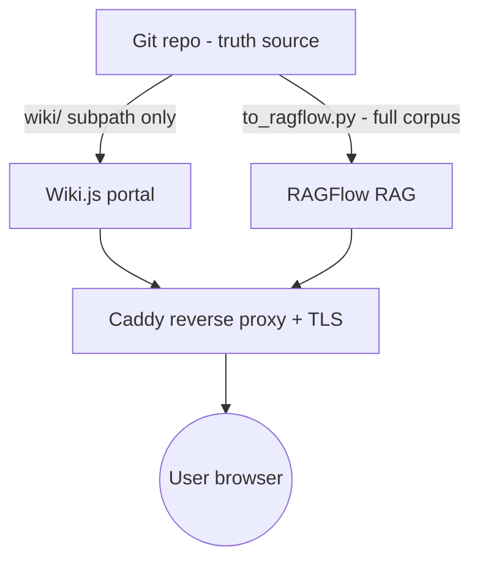

# v1 Deployment Topology

> **AI 接力开发指南** — 这份文档是 v1 单机部署拓扑的**唯一视觉 + 文字契约**。任何接手此项目的工程师或 AI 应先读本文，再读 `docker-compose.yml.draft`。本文锁定的栈版本来自 `.planning/research/STACK.md`（Wiki.js 2.5.314 / Postgres 16 / RAGFlow v0.25.1 / Caddy 2.x），**不得擅自更改**。本文为 Phase 6 DEP-03 交付物。

## What this doc is

- **Locked** (do not change without an ADR + Phase planning):
  - Service set: Wiki.js, Postgres, RAGFlow, Elasticsearch, MinIO, Redis, Caddy
  - Image versions per STACK.md
  - Wiki.js Git scope = `wiki/` ONLY (DEP-04, see `deploy/wiki-git-storage.md`)
  - Authentik deferred (DEP-05, see `deploy/authentik-phase2.md`)
  - Truth source = Git; vector store = rebuildable derivative (DEP-06, see `deploy/backup-restore.md`)

- **Directional** (will be filled in by promotion phase):
  - `deploy/caddy/Caddyfile` is a stub — TLS + path routing TBD
  - Concrete host ports may shift if multi-tenant
  - GPU vs CPU `RAGFLOW_DEVICE` per actual host

## Cross-references

| File | Purpose |
| --- | --- |
| `deploy/docker-compose.yml.draft` | Service topology (DRAFT — NOT FOR PRODUCTION) |
| `deploy/.env.example` | Every env var the compose draft references |
| `deploy/wiki-git-storage.md` | DEP-04 — Wiki.js Git scope rule (`wiki/` ONLY) |
| `deploy/authentik-phase2.md` | DEP-05 — SSO deferred (RAGFlow OIDC bug #12568) |
| `deploy/backup-restore.md` | DEP-06 — Postgres dump + Git push; vector store rebuildable |
| `.planning/research/ARCHITECTURE.md` | Phase 1 system overview (this topology mirrors §"System Overview") |
| `.planning/research/STACK.md` | Authoritative image versions |

---

## ASCII data-flow diagram

```
+-------------------------------------------------------------+
|                         Git (truth)                          |
|  ontology/  instances/  docs/  wiki/  .planning/  scripts/   |
+----------------+--------------------+-----------------------+
                 |                    |
                 |  (wiki/ only)      |  (full corpus,
                 |  via Wiki.js Git   |   read-only via
                 v  Storage module)   v   to_ragflow.py)
        +----------------+      +----------------+
        |   Wiki.js      |      |   RAGFlow      |
        |   (Postgres)   |      |   (ES + MinIO  |
        |                |      |    + Redis)    |
        +-------+--------+      +-------+--------+
                |                       |
                +-----------+-----------+
                            |
                            v
                     +-------------+
                     |    Caddy    |
                     | (TLS proxy) |
                     +------+------+
                            |
                            v
                       +---------+
                     User (browser)
                       +---------+
```

## Mermaid alternative



---

## Data-flow narrative

**Git is the truth source.** Every canonical artifact (ontology schemas, instance YAML, docs metadata, design markdown, the Wiki-rendered narrative pages under `wiki/`) lives in Git first. Two downstream consumers subscribe with **different scopes**:

1. **Wiki.js** subscribes ONLY to the `wiki/` subdirectory via its Git Storage module (DEP-04 hard rule). Editors using Wiki.js cannot reach `ontology/`, `instances/`, `scripts/`, or `.planning/` — they are physically out of scope. This protects the validator pipeline from out-of-band edits. Wiki.js page bodies live in Postgres as a render cache; the source of truth is the Markdown pushed back to `wiki/` in Git.

2. **RAGFlow** indexes the **full corpus** via the `scripts/exporters/to_ragflow.py` exporter. RAGFlow's Elasticsearch indexes (vector + sparse) and MinIO blobs (parsed chunks) are **derivatives**, not truth — they are rebuildable from Git via `to_ragflow.py --rebuild` and therefore not backed up (DEP-06). Citation metadata stays anchored to the canonical document IDs in Git.

**Caddy** fronts both services with TLS termination and path routing (Caddyfile is a Phase 6 stub; promotion phase fills in `/` → wiki, `/rag` → ragflow). Users only ever talk to Caddy on ports 80/443.

**Authentik (SSO IdP)** is **commented out** in the compose draft. The block is preserved with env-var placeholders so a future phase can uncomment when the trigger condition fires (RAGFlow OIDC bug #12568 closed AND FR #3495 merged). See `deploy/authentik-phase2.md`.

---

## Truth vs derivative summary

| Layer | What | Backed up? |
| --- | --- | --- |
| Truth | Git repo (ontology, instances, docs metadata, wiki/, design) | YES — `git push` to remote |
| Truth | Wiki.js page content (also pushed to `wiki/` in Git) | YES — via Wiki.js Git push + nightly `pg_dump` of Postgres cache |
| Derivative | RAGFlow Elasticsearch indexes | NO — rebuildable via `to_ragflow.py --rebuild` |
| Derivative | RAGFlow MinIO chunk blobs | NO — rebuildable via re-ingestion |

See `deploy/backup-restore.md` for the full backup matrix and rebuild runbook.

---

## Single-host sizing snapshot

Per STACK.md "Hardware / Storage Sizing":
- Min: 4 cores, 16 GB RAM, 50 GB disk
- Recommended: 8 cores, 32 GB RAM, 200 GB SSD
- GPU optional (DeepDoc / local LLM — both deferred in v1)

This topology is single-host on purpose. K8s / multi-host is out of scope until the v1 stack proves stable in production (see `.planning/ROADMAP_FUTURE.md` for promotion triggers).

---

## Open questions (deferred)

- **TLS provisioning**: ACME-via-Caddy auto vs manual certs? Decided in promotion phase.
- **Backup off-host destination**: S3 / rsync / tape? Decided per deployer.
- **Multi-tenant isolation**: out of v1 scope; revisit when ≥2 organizations need separation.
